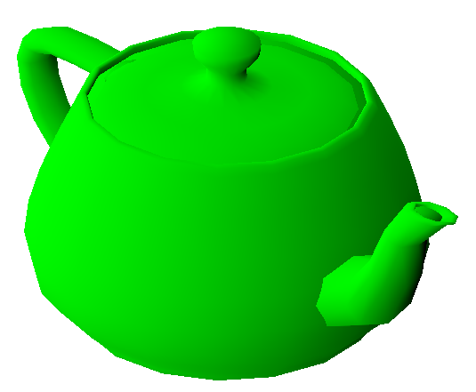
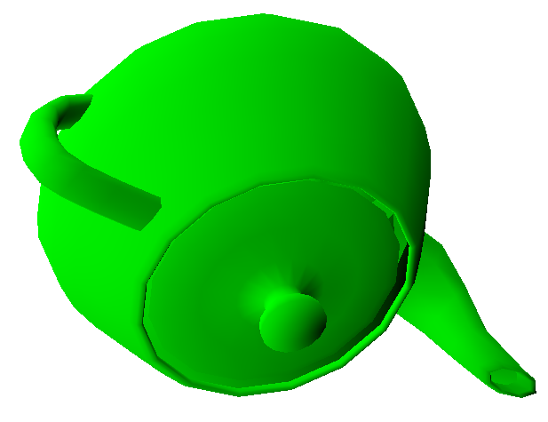

# Rotation matrices

A linear operator which rotates a Euclidean vector about an axis can be represented as a transformation matrix.
Applying the operator can then be reduced to matrix multiplication, [details](theory/rotation_matrices.pdf).

## Teapot
This code is a simple implementation of the described property on the [Utah teapot](https://en.wikipedia.org/wiki/Utah_teapot).

